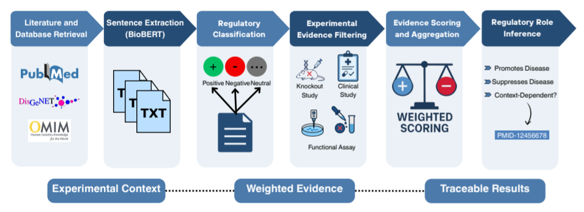
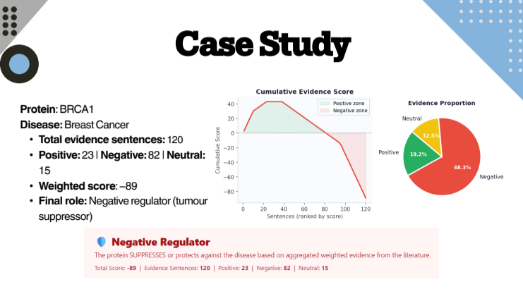
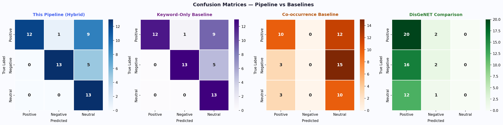
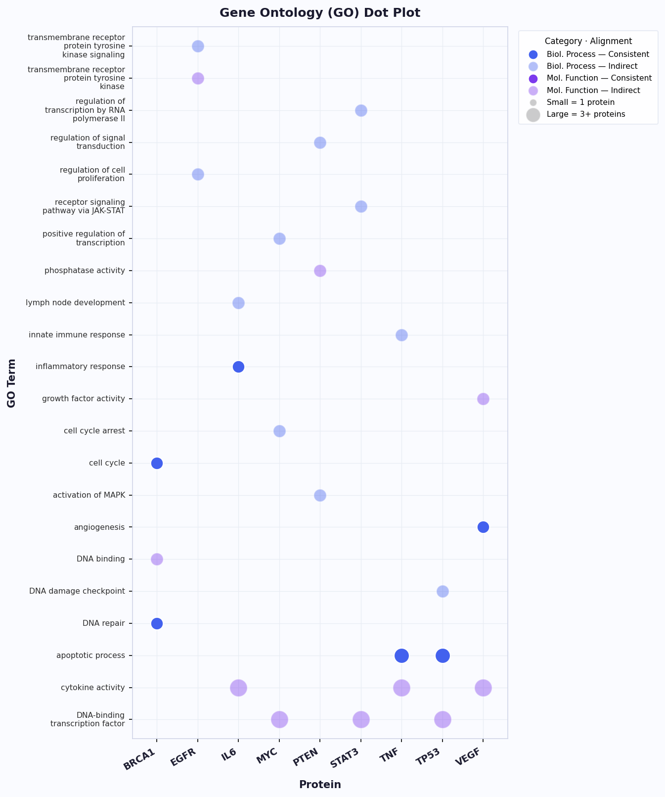
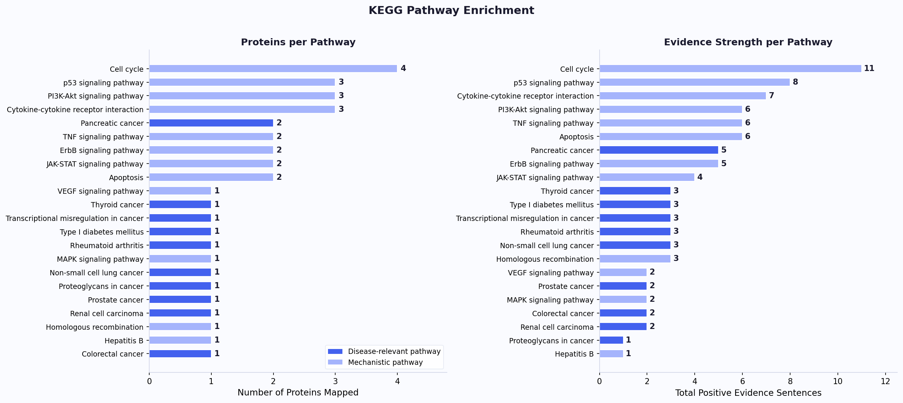
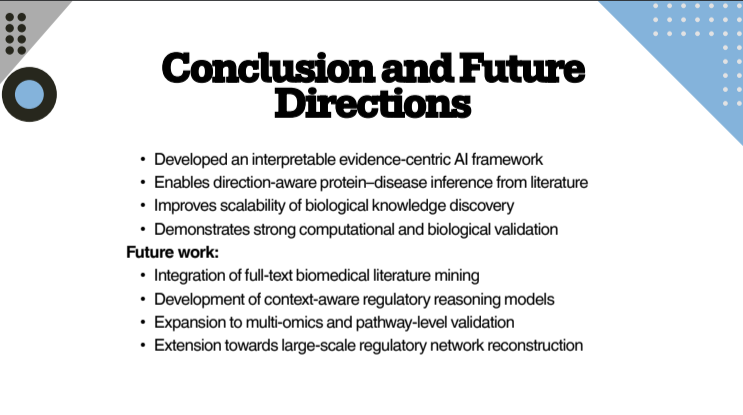

# 🧬 An Evidence-Centric AI Pipeline for Protein–Disease Regulation Identification

> An interpretable computational framework for identifying protein–disease regulatory relationships through evidence-centric literature mining and natural language processing.


---

## Table of Contents

- [Overview](#overview)
- [Objectives](#objectives)
- [Pipeline Workflow](#pipeline-workflow)
- [Key Features](#key-features)
- [Technologies & Resources](#technologies--resources)
- [Case Study](#case-study)
- [Preliminary Evaluation](#preliminary-evaluation)
- [Repository Structure](#repository-structure)
- [Future Directions](#future-directions)
- [Contributors](#contributors)
- [Citation](#citation)

## Overview

Understanding whether a protein promotes or suppresses disease is fundamental to target identification, biomarker discovery, and therapeutic development.

This project presents an **evidence-centric computational framework** that systematically integrates experimentally validated information from biomedical literature to infer protein–disease regulatory roles.

Unlike predictive or black-box AI models, this framework emphasizes **interpretability**, **traceability**, and **biological evidence**, ensuring that every inferred regulatory relationship can be linked back to supporting scientific literature.

This work was presented at **SYMBIOT'26 – 3rd International Conference on Medicine, Biological Sciences & Omics Technologies**.

> **Research Notice**
>
> This repository documents the methodology, workflow, and scientific outcomes of the project. The implementation code is intentionally withheld as the work forms part of ongoing academic research intended for future publication.

---

# Objectives

The framework aims to:

- Retrieve protein–disease evidence from biomedical literature
- Extract regulatory statements using domain-specific NLP
- Classify regulatory direction
- Filter experimentally validated evidence
- Aggregate weighted evidence across studies
- Infer consensus regulatory roles
- Produce interpretable and traceable outputs

---

# Pipeline Workflow

```
Biomedical Literature Retrieval (PubMed)
                    │
                    ▼
Sentence Extraction using BioBERT
                    │
                    ▼
Regulatory Classification
Positive • Negative • Neutral
                    │
                    ▼
Experimental Evidence Filtering
                    │
                    ▼
Weighted Evidence Aggregation
                    │
                    ▼
Consensus Regulatory Role Inference
                    │
                    ▼
Traceable Results Linked to Literature
```

## Pipeline Architecture

<p align="center">

</p>

---

# Key Features

- Evidence-centric AI framework
- BioBERT-assisted sentence extraction
- Direction-aware regulatory classification
- Rule-based experimental evidence filtering
- Weighted evidence aggregation
- Traceable regulatory inference
- Literature-backed biological interpretation
- Transparent and interpretable workflow

---

# Technologies & Resources

## Programming

- Python

## Natural Language Processing

- BioBERT

## Literature Sources

- PubMed

## Biological Databases

- NCBI
- UniProt
- Protein Data Bank (PDB)

---

# Case Study

The framework was demonstrated using **BRCA1** in breast cancer.

The workflow successfully:

- Retrieved protein–disease literature
- Extracted evidence sentences
- Classified regulatory direction
- Aggregated weighted experimental evidence
- Inferred consensus regulatory roles

The inferred regulatory role was consistent with the well-established tumour suppressor function of **BRCA1**, demonstrating biological plausibility.

## Representative Case Study

<p align="center">

</p>
---

# Preliminary Evaluation

Initial evaluation demonstrated promising performance for regulatory direction classification.

Highlights include:

- Direction-aware sentence classification
- Balanced precision and recall
- Evidence-based regulatory inference
- Biological consistency with established literature

Performance figures and representative outputs are available in the **figures/** directory.
## Classification Performance

<p align="center">

</p>

## Biological Validation

<p align="center">

</p>

<p align="center">

</p>
---

# Repository Structure

```
protein-disease-ai-pipeline/

├── documentation/
│   ├── abstract.md
│   ├── methodology.md
│   ├── research_gap.md
│   └── future_work.md
│
├── datasets/
│   └── README.md
│
├── figures/
│   ├── pipeline_workflow.png
│   ├── brca1_case_study.png
│   ├── classification_performance.png
│   ├── biological_validation.png
│   └── future_directions.png
│
├── presentation/
│   └── SYMBIOT2026_Presentation.pdf
│
├── references/
│   └── references.md
│
└── README.md
```

---

# Presentation

**Conference**

SYMBIOT'26

**Event**

3rd International Conference on Medicine, Biological Sciences & Omics Technologies

**Institution**

Manipal Institute of Technology

**Date**

March 2026

---

# Future Directions

- Full-text biomedical literature mining
- Context-aware regulatory reasoning
- Multi-omics integration
- Pathway-level validation
- Regulatory network reconstruction
- Large-scale biological knowledge graph development

## Future Roadmap

<p align="center">

</p>

---

# Contributors

### Krithika V

- Literature review
- Workflow conceptualization
- Computational pipeline design
- Conference presentation
- Repository documentation

### Dr. Fayaz S.M.

- Research supervision
- Scientific guidance
- Project mentorship

---

# Acknowledgements

This work was carried out under the guidance of **Dr. Fayaz S.M.** at **Manipal Institute of Technology**.

I sincerely acknowledge his mentorship, valuable discussions, and continuous guidance throughout the development of this research.

---

# Citation

If you reference this work, please cite:

> **Krithika V., Fayaz S.M.**
>
> *An Evidence-Centric AI Pipeline for Protein–Disease Regulation Identification.*
>
> Presented at **SYMBIOT'26 – 3rd International Conference on Medicine, Biological Sciences & Omics Technologies**, Manipal Institute of Technology, 2026.

---

# Research Status

🚧 **Ongoing Academic Research**

The computational implementation and source code are intentionally not included because this work forms part of ongoing research intended for future publication.

This repository is designed to document the scientific methodology, computational workflow, and research outcomes while protecting unpublished intellectual contributions.

---

# Contact

**Krithika V**

M.Sc. Computational Molecular Sciences

Manipal Institute of Technology

📧 krithikav.mitmpl2025@learner.manipal.edu

🔗 LinkedIn: linkedin.com/in/krithikavenkatraman

---

⭐ If you found this repository interesting, feel free to star it.
